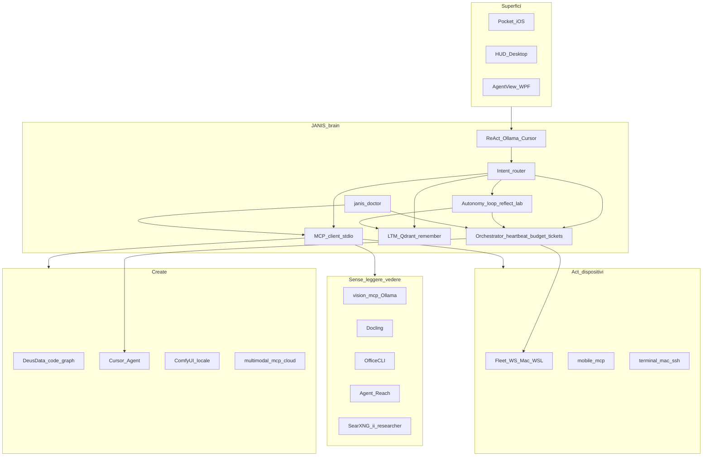

# JANIS — Piano integrazione multi-fonte (master)

> Stato: **W6a–W7c implementati in codice** (sidecar esterni opzionali: installare binari per full power)  
> Aggiornato: 2026-07-16  
> Radar: [`TECH-RADAR-CAPABILITIES.md`](TECH-RADAR-CAPABILITIES.md)

## Principio

**JANIS = cervello unico.** Tutto il resto è **sidecar** (MCP/CLI) o **pattern nativo** (orchestrator).  
Non clonare Paperclip/DeusData/Agent-Reach come app separate che competono col brain.

---

## Architettura target (tutte le tech)



### Mappa tech → ruolo

| Layer | Tech | Integrazione |
|-------|------|--------------|
| **Nervous system** | MCP client (`mcp_client.py`) | Prerequisito di tutto |
| **Memory persona** | LTM + Qdrant + reflect | Nativo JANIS |
| **Memory codice** | DeusData codebase-memory-mcp | MCP + tools `code_*` |
| **Orchestrazione** | Pattern Paperclip | Nativo `orchestrator/` |
| **Internet eyes** | Agent-Reach | Tool `reach` |
| **Deep research** | SearXNG + ii-researcher | Tool `research` |
| **Documenti** | Docling + OfficeCLI | Tools `doc_read` / `office_edit` |
| **Visione** | vision-mcp + Ollama | `describe_vision` |
| **Media gen** | ComfyUI | `image_gen` / `video_gen` |
| **Dispositivi** | Fleet + mobile-mcp | `fleet_execute` / `mobile_ui` |
| **Migliora sé** | Lab + reflect → ticket | Nativo W7c |
| **Doctor** | `janis_doctor` | Nativo W7b |

---

## Sprint unificato W6–W7

| Sprint | Deliverable | Stato |
|--------|-------------|-------|
| **W6a** | MCP client + `mcp_*` | **fatto** |
| **W6b** | `code_search/index/symbol/context` | **fatto** (serve binario DeusData) |
| **W6c** | Board + heartbeat + budget | **fatto** |
| **W6d** | Intent router + board in HUD/prompt | **fatto** |
| **W6e** | Smoke test + docs | **fatto** (push su richiesta) |
| **W6f** | `doc_read` / `office_edit` | **fatto** (serve Docling/OfficeCLI) |
| **W6g** | `image_gen` / `video_gen` ComfyUI | **fatto** (serve ComfyUI up) |
| **W6h** | `research` / `reach` | **fatto** (SearXNG / Agent-Reach) |
| **W6i** | vision-mcp → `describe_vision` | **fatto** (fallback Ollama) |
| **W6j** | `mobile_ui` + `fleet_execute` registered | **fatto** (mobile-mcp su Mac) |
| **W7a** | Approval gates + Pocket notify | **fatto** |
| **W7b** | `janis_doctor` + heal Ollama + job orario | **fatto** |
| **W7c** | Reflect/gap/lab → ticket; sense_act; digest | **fatto** |

---

## Tool nuovi (registry)

`code_*`, `doc_read`, `office_edit`, `image_gen`, `video_gen`, `research`, `reach`, `mobile_ui`, `janis_doctor`, `board_*`, `mcp_*`, `fleet_execute`

## API orchestrator

| Method | Path |
|--------|------|
| GET | `/api/orchestrator/status` |
| GET/POST | `/api/orchestrator/tickets` |
| POST | `/api/orchestrator/tickets/{id}/claim\|done` |
| POST | `/api/orchestrator/heartbeat` |
| POST | `/api/orchestrator/autonomy` |
| GET | `/api/orchestrator/approvals` |
| POST | `/api/orchestrator/approvals/{id}/decide` |
| POST | `/api/orchestrator/notify` |

## Config `.env`

```
MCP_ENABLED=true
HEARTBEAT_ENABLED=true
COMFYUI_URL=http://127.0.0.1:8188
SEARXNG_URL=http://127.0.0.1:8080
DOCTOR_HEAL_ENABLED=true
APNS_KEY_PATH=   # opzionale push reale
```

## Sidecar da installare (host)

1. `codebase-memory-mcp` (DeusData)  
2. `docling-mcp` + `officecli`  
3. ComfyUI su `:8188`  
4. SearXNG su `:8080` (+ opz. `ii-researcher-mcp`)  
5. `agent-reach` CLI  
6. `vision-mcp`  
7. `mobile-mcp` sul Mac Mini  

Verifica: tool `janis_doctor` o chat «janis doctor».  
Install host: [`SIDECARS-INSTALL.md`](SIDECARS-INSTALL.md).

## Autonomia default: **L2 Bounded**

- Heartbeat esegue ticket `safe|research|index|lab`  
- `code|media|device|cloud` → blocked + approval + notify Pocket  
- Approve: `POST /api/orchestrator/approvals/{id}/decide` → ticket riapre con `approved=true`

## Fuori scope (invariato)

- Deploy Paperclip full · post social · fork DeusData · Mode B Debian
