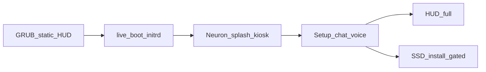

# JANIS Live Distro — specifica prodotto

> Canvas: [`canvases/janis-live-distro.canvas.tsx`](../canvases/janis-live-distro.canvas.tsx)  
> Aggiornato: 2026-07-17  
> Verdetto: **fattibile** (neuroni **dopo** GRUB, non dentro GRUB)

---

## Requisiti hardware

| Risorsa | Minimo | Consigliato |
|---------|--------|-------------|
| **RAM** | **16 GB** | **32 GB** |
| USB | 32 GB per profilo | 32 GB × fino a 4 stick / Ventoy multi-ISO |
| GPU | nessuna (Safe) | NVIDIA (ISO NVIDIA Live o first-boot su SSD) |

All’avvio del wizard: se RAM &lt; 16 GB → avviso bloccante/soft-warn (badge rosso); se ≥ 32 GB → badge “full”.

---

## Boot chain



| Fase | Cosa vede l’utente | Tecnologia |
|------|-------------------|------------|
| **GRUB** | Logo JANIS, menu stilizzato, sfondo futuristico statico | [`infra/grub/theme/`](../infra/grub/theme/) · PNG |
| **Kernel** | Splash quiet (opz. Plymouth) | `live-boot` + initrd ricostruito |
| **Neuron splash** | Cervello di neuroni che si forma a schermo intero | Chromium kiosk → `/server?phase=boot` · `janis-neurons.js` |
| **Wizard** | Mini chat/voce + risorse HUD che si accendono | brain `:8001` · overlay `janis-panel` |
| **Ready** | HUD completo chat-first | `/server` |

**Vincolo:** GRUB non esegue Three.js. La “rappresentazione del brain” è la fase **Neuron splash**.

---

## GRUB — asset grafici (statici)

Checklist in [`infra/grub/README.md`](../infra/grub/README.md).

### Design token: un solo background base

**`infra/grub/theme/background.png` è la base visuale di tutto il sistema Live Distro.**

| Superficie | Uso del background |
|------------|-------------------|
| **GRUB** | Immagine desktop così com’è |
| **Neuron splash / kiosk** | Stesso asset sotto i neuroni |
| **Wizard setup** | Stesso base; sopra HUD risorse + chat + overlay |
| **HUD runtime** | Stesso base (o layer blur/vignette), non un altro mood |

Regole: palette/griglia del PNG GRUB = contratto UI; varianti solo come **layer**; riferimento **1920×1080**; cambiando il PNG GRUB si aggiorna l’identità di tutto il boot→desktop.

| File | Spec |
|------|------|
| `theme/background.png` | 1920×1080 · `#050B12` · cyan `#3DE0FF` · griglia HUD · **master background** |
| `theme/selected_c.png` (o set selected_*) | Barra selezione menu |
| `theme/theme.txt` | title JANIS, colori chiari su scuro |
| Menu entries | Safe Live · Chat-ready · NVIDIA Live · info install · next disk |

Niente animazione nel GRUB: profondità solo via PNG (glow, scanline finti nel bitmap).

---

## Post-boot — neuron splash + kiosk

1. Autostart: `janis-brain.service` → Ollama ready (o defer) → Chromium kiosk  
2. URL: `http://127.0.0.1:8001/server?phase=boot&v=livedistro01`  
3. `phase=boot`: canvas neuroni fullscreen 4–8 s (crescita nodi), poi dissolve verso wizard/chat  
4. Codice base: `packages/brain/frontend/janis-neurons.js`, `app.js` brain mount  
5. Se Ollama lento: splash comunque; chat mostra “collegamento neurale in corso”

---

## Setup wizard scenografico

### Layout (una composizione)

```
┌────────────────────────────────────────────────────────┐
│  SFONDO HUD: CPU · RAM · DISK · GPU · NET (fade-in)    │
│                                                        │
│         [ brain orb / neuroni ridotti ]                │
│                                                        │
│     ┌─ mini chat ─────────────────────────┐            │
│     │ testo + 🎙 voce                      │            │
│     │ suggerimenti funzioni                │            │
│     └──────────────────────────────────────┘            │
│                                                        │
│  overlay (se serve): rete / utente / driver / WIPE     │
└────────────────────────────────────────────────────────┘
```

### Risorse a sfondo

Allineate a `GET /api/host/metrics` (e Fabric):

| Risorsa | Quando si “accende” |
|---------|---------------------|
| CPU | detect host |
| RAM | lettura meminfo + badge 16/32 |
| Disco | rootfs / USB / target SSD |
| GPU | lspci NVIDIA → safe vs nvidia path |
| Rete | NetworkManager up |
| Brain | `:8001` ok |
| Ollama | `/api/tags` ok |

Stile: Adobe Stock “futuristic HUD” + [`janis-theme.css`](../packages/brain/frontend/janis-theme.css) (cyan, griglia, scan).

### Chat / voce

- Stesso pipeline WebSocket chat del prodotto (`docs/JANIS-PRODUCT-APP.md`)  
- Comandi wizard: «stato», «connetti wifi», «installa», «mostra funzioni», «janis doctor»  
- TTS legge i passi chiave; mic per conferma

### Overlay

Finestre necessarie **sopra** lo sfondo (non sostituiscono la scena):

| Overlay | Trigger |
|---------|---------|
| Wi‑Fi / Ethernet | rete assente |
| Credenziali utente live | primo login se richiesto |
| Driver NVIDIA | profilo NVIDIA o install SSD |
| Conferma WIPE | solo `deploy-disk` — digitare `WIPE` |
| RAM insufficiente | &lt; 16 GB |

Implementazione: `panel` open con `janis-panel.js` (z-index alto, vetro HUD).

---

## ISO matrix — fino a 4 funzioni (USB 32 GB)

| # | Profilo | Contenuto | Escluso | Dim. tipica |
|---|---------|-----------|---------|-------------|
| **1** | **Safe / Rescue** | live-boot, i3, SSH, tools, docs | NVIDIA, modelli, Comfy | ~3–5 GB |
| **2** | **Chat-ready** | + brain+venv, Ollama, 1 modello piccolo, kiosk, voce, wizard | Comfy, modelli grandi | ~8–12 GB |
| **3** | **NVIDIA Live** | Chat-ready + `nvidia-driver`, blacklist nouveau | Comfy pesante | ~10–14 GB |
| **4** | **Media / Create** | Comfy + checkpoint base **oppure** first-boot pull | resto opzionale | ~15–22 GB |

**Distribuzione:** 1 ISO per stick 32 GB, **oppure** Ventoy su una stick con le 4 ISO.  
Non una singola ISO da 32 GB “tutto incluso” (fragile e lenta da scrivere).

Persistenza USB opzionale su profili 2–3 (partizione `persistence`).

---

## GPU policy

| Path | Comportamento |
|------|----------------|
| Safe Live (#1–2) | Nouveau/CPU — boot affidabile |
| NVIDIA Live (#3) | Driver in squashfs; validare su hub RTX 3080 Ti |
| SSD install | [`janis-first-boot.sh`](../TESTER/chroot-config.sh) installa `nvidia-driver`; wipe **gated** ([`MODE-B-SSD2-GATE.md`](MODE-B-SSD2-GATE.md)) |

---

## Gate

- [ ] Build ISO su host Linux (`TESTER/build-base.sh` → `build-iso.sh`)  
- [ ] USB test boot (`write-usb.sh`, conferma `WRITE`)  
- [ ] Wipe SSD2 **solo** dopo OK esplicito + digitazione `WIPE`  
- [ ] Wizard non offre wipe senza gate  

---

## Riferimenti codice

| Pezzo | Path |
|-------|------|
| Neuroni | `packages/brain/frontend/janis-neurons.js` |
| HUD / kiosk | `/server`, `packages/kiosk/` |
| Overlay | `packages/brain/frontend/janis-panel.js` |
| Metrics | `GET /api/host/metrics` |
| Fabric | `GET /api/capabilities` |
| ISO pipeline | `TESTER/` |
| Product north star | [`JANIS-PRODUCT-APP.md`](JANIS-PRODUCT-APP.md) |
